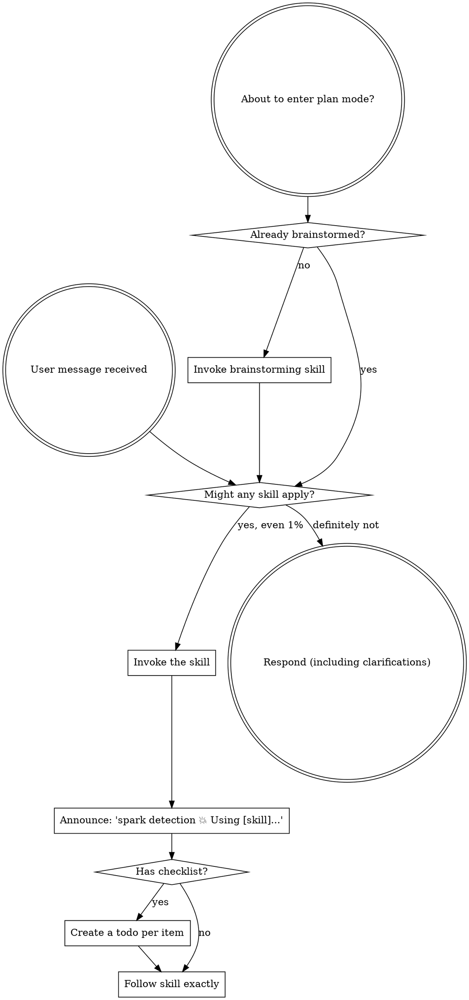

<SUBAGENT-STOP>
If dispatched as a subagent for a specific task, skip this skill.
</SUBAGENT-STOP>

<EXTREMELY-IMPORTANT>
Even a 1% chance a skill applies means invoke it now, as your first tool call — before clarifying questions, before explaining, before responding. Not optional, not negotiable.
</EXTREMELY-IMPORTANT>

## Priority

User instructions (CLAUDE.md, GEMINI.md, AGENTS.md, direct requests) outrank SPARK skills, which outrank default system behavior. If a user instruction conflicts with a skill (e.g. "don't use TDD" vs. "always use TDD"), follow the user.

## Accessing Skills

Never read skill files manually — use your platform's loading mechanism so the skill activates properly: Claude Code's `Skill` tool, Codex's native loading, Copilot CLI's `skill` tool, Gemini CLI's `activate_skill`. Per-platform tool mapping: [claude-code-tools.md](references/claude-code-tools.md), [codex-tools.md](references/codex-tools.md), [copilot-tools.md](references/copilot-tools.md), [gemini-tools.md](references/gemini-tools.md), [pi-tools.md](references/pi-tools.md), [antigravity-tools.md](references/antigravity-tools.md).

# Using Skills

Invoke relevant or requested skills BEFORE any response — even at 1% likelihood. Wrong guesses are fine to drop; missed checks are not. If the prompt matches a skill's purpose, or names one, invoke it immediately — no conversational answer first.

## Announcement Format

Announce every invocation as the first thing you say:
`spark detection 💥 Using [skill] to [purpose]`

## Red Flags

These thoughts mean STOP — you're rationalizing:

| Thought | Reality |
|---------|---------|
| "This is just a simple question" | Questions are tasks. Check for skills. |
| "I need more context first" | Skill check comes BEFORE clarifying questions. |
| "This doesn't need a formal skill" | If a skill exists, use it. |
| "I remember this skill" | Skills evolve. Read current version. |

## Skill Priority

Process skills (brainstorming, systematic-debugging) go first — they determine HOW to approach the task. Implementation skills (frontend-design, mcp-builder) go second — they guide execution.

"Let's build X" → brainstorming, then implementation skills.
"Fix this bug" → if `.docs/` project memory exists, use bug-fix (meta-skill orchestrating context-grounding + systematic-debugging + TDD); otherwise, or if the task is too small for full orchestration, use systematic-debugging directly.
"Add this feature" → if `.docs/` exists, use enhancement; otherwise use brainstorming directly.
"Review/audit this code" → if `.docs/` exists and the request is a broader quality/architecture/security check, use audit; for a review of a specific diff or before merging, use requesting-code-review instead.

## Optional Integrations

If the user asks for an enabled external integration, or the project has an enabled marker under `.spark/integrations/`, load the matching adapter skill before the downstream SPARK skill. Adapter routing is opt-in and read-only by default. Always read `references/optional-integrations.md` before using an adapter.

## Skill Types

Rigid skills (TDD, systematic-debugging): follow exactly, don't adapt away discipline. Flexible skills (patterns): adapt to context. The skill tells you which.

## User Instructions

Instructions say WHAT, not HOW — "Add X" or "Fix Y" doesn't mean skip workflows.
